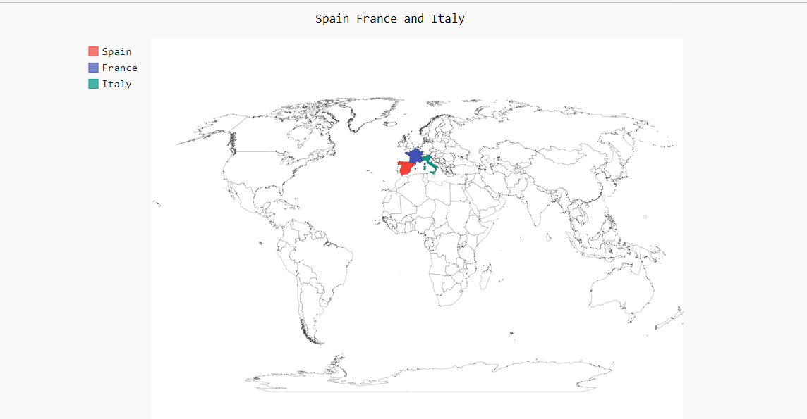

# svg_map_python

 Al ejecutar este script se crea un mapa SVG, donde se ve de colores España, Francia y Italia.
 
 
## Antes de ejecutar el script

~~~~

pip install pygal_maps_world
~~~~

## Uso del Script

~~~~

python world.py

~~~~

Se crea un archivo .svg, donde has ejecutado el anterior comando, al abrir el archivo se muestra lo siguiente.

# Resultado

